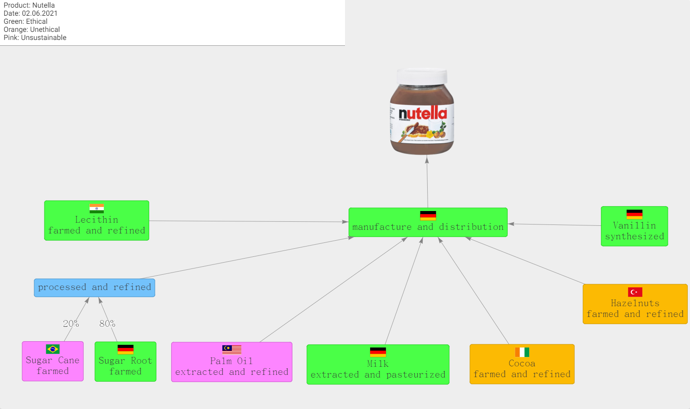

# FairChain

## About FairChain

Fairchain is a web application built using the web framework [Angular](https://angular.io/) and the graphing library [vis.js](https://visjs.org/). The app allows users to create their own custom production chains, which visually communicate how ehtical or sustainable the individual links are. The app is intended to be developed into a pluging for shopping websites, so that customers can estimate how ethical their purchase of a product is.

The following image is an example of such a production chain

## Installation

Clone the repository into a folder on your computer.

Open the command prompt in the cloned repository and run the following command

`npm install --save-dev @angular-devkit/build-angular`

Finally run

`npm install html-to-png`

## Usage

In a command prompt in the repository, run `ng serve` for a dev server. Navigate to `http://localhost:4200/`. The app will automatically reload if you change any of the source files.

To execute the test cases of the application, run `ng test` in a command propt in the repository.

## Developers

Blendi Shala - master tracker\
Jethro Warnett - quality evangelist\
Korab Bejta - key account manager\
Lawrence Chiang - scrum master\
Marco De Liso - chief deliverable officer

## Contributing

[Contributing](CONTRIBUTING)

## License

[LGPL-2.1 License](LICENSE)
